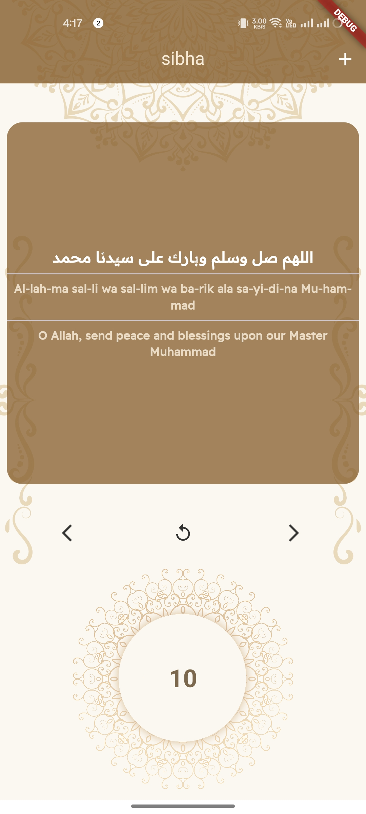

# Sibha App


## Overview

The **Sibha App** is a digital counter designed to help users keep track of their tasbeeh (recitation) counts with ease. This app simulates the traditional *sibha* (prayer beads) used in many Islamic practices, providing a simple and intuitive interface for counting.

## Features

- **Digital Counter**: Easily count your tasbeeh with a digital interface.
- **Reset Functionality**: Reset your count with a single click.
- **Simple and Clean UI**: A user-friendly design that mimics traditional prayer beads.
- **Persistent Count**: The app saves your count even if you close it, so you can continue where you left off.

## Installation

To install and run the app:

1. Clone the repository:
   ```bash
   git clone https://github.com/Epic-Apps-Hub/sibha-counter-flutter-app
   ```

2. Navigate to the project directory:
   ```bash
   cd sibha-counter-flutter-app
   ```

3. Install dependencies:
   ```bash
   flutter pub get
   ```

4. Run the app:
   ```bash
   flutter run
   ```


## Contributing

Contributions are welcome! Please feel free to submit a Pull Request or open an Issue.


## Contact

If you have any questions or suggestions, feel free to contact me at m4hmoudatef@gmail.com.
